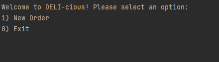
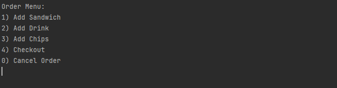
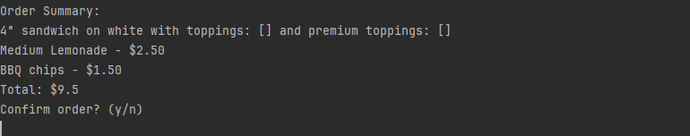

DELI-cious Point-of-Sale System

Overview:
DELI-cious is a point-of-sale application for a sandwich shop. 
It allows customers to build and customize their orders, including selecting sandwich sizes, drink flavors, and chips varieties. 
The app calculates the total price, provides a detailed order summary, and generates a receipt.

Features:
Create a new order with various items (sandwiches, drinks, chips).
Add multiple sandwiches, drinks, and chips to a single order.
Automatically calculate the total price based on the items selected.
Save the order as a receipt in the "receipts" directory with a timestamp.
Display an order summary before confirmation.
Cancel an order if needed.

Technologies Used:
Java (for the core application logic)
Scanner (for input handling)
FileWriter (to generate and save receipts)
SimpleDateFormat (for creating unique filenames for receipts)

How to Use:
1)Upon starting the application, you will be prompted with the main menu.
2)Select "New Order" (option 1) to begin creating an order.
3)Follow the prompts to:
    -Add a Sandwich by specifying size (4", 8", 12"), bread type, and optional toppings.
    -Add a Drink by specifying size and flavor.
    -Add Chips by specifying the flavor.
4)After adding items, you can either:
    -Checkout (option 4) to finalize the order and save a receipt.
    -Cancel (option 0) the order to discard it.
5)A receipt will be generated in the receipts/ folder with a timestamp and the order details.

Example
Main Menu:

Order Menu:

Receipt Example:

